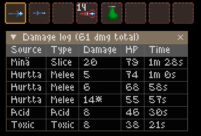
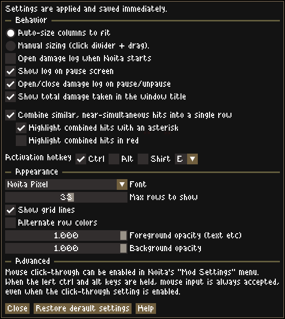
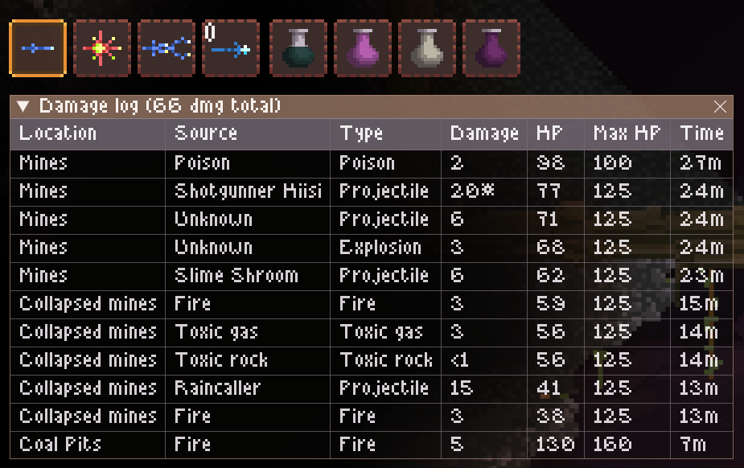

# A damage log for Noita

damagelog is a [Noita](https://store.steampowered.com/app/881100/Noita/) mod that shows a list of the the damage you've taken, and from what sources.  
The log window can be toggled with a hotkey, or shown automatically when in the pause menu.

The mod should work on the main branch of Noita (no earlier than April 8 2024, however!) and the beta branch.  

There's a fair amount of settings you can customize.
(This screenshot is outdated, but it has most of the settings.)

Here's a screenshot with all columns active. (Columns are toggled by right-clicking the column header, and reordered by clicking and dragging in the header.)

## Initial setup

* Install [NoitaDearImGui](https://github.com/dextercd/Noita-Dear-ImGui/releases) by downloading the latest release and unpacking the "NoitaDearImGui" folder to your Noita "mods" folder (located wherever the game is installed). The other two folders are not required.  
* Download the latest release of this mod [here](https://github.com/exscape/Noita-damagelog/releases) (do **not** click the green "Code" button) and unpack it to your "mods" folder. **Double check that the folder is named "damagelog" as the mod won't work otherwise.**
* Start Noita and click "Mods". Enable "Unsafe mods" on the right -- this is required because NoitaDearImGui uses native (C++) code and libraries. This mod does not use any unsafe/restricted code however (see mod.xml).
* Make sure this mod is located **below** NoitaDearImGui by using the "Move down" button in the mod list, and make sure both mods are enabled.
* Start or continue your game. The help screen will pop up (once!).

If you continue a previous game, damage taken prior to installing the mod won't be shown.

# Changelog

# v0.9 (2024-06-08)

**New features / improvements:**

* Allow combining damage to previous rows (e.g. when you're hit by an enemy while on fire, there won't be multiple "fire" rows but the same one will be reused)
* Allow combining damage of different types *from a single source* to one row (e.g. the Slimeball/Limanuljaska -- the green slimy monsters that hit with both projectile and explosion damage). Hover the damage number to view details.
* Add "log healing" setting. Off by default as it's only really useful with Healing Bolt (not *any* other form of healing including Deadly Heal, Circle of Vigour, hearts, ...)

**Bug fixes:**

* Don't show current HP as 1 after you've died
* Fix cursed area damage (e.g. between PWs) source showing as "Holy Mountain"
* Fix possible log data corruption due to an oversight with quote replacement
* A few other minor fixes behind the scenes that probably won't be noticed

# v0.8 (2024-04-28)

Initial public release. (Though I made no release announcement, so it probably has 0 users.)

# FAQ (that nobody has actually asked yet)

## I'm getting errors about "ImGui not available"

Check the initial setup guide above.

## The window is not showing up / I don't know the activation hotkey

The default activation hotkey is Ctrl+Q. If that's not it, go to the Noita "Mods" menu, click "Mod Settings", and restore the settings for the mod.  
Once you return to the game, it should show up, and let you set it up the way you want it.  

## Can I change any settings?

Yes! Right-click any row in the damage log, i.e. not the table header or the window titlebar.

One setting (mouse click-through) is only available in the Noita "Mod Settings" menu, to avoid the risk of getting "locked out".  
However, holding the left Ctrl + left Alt keys will make the window temporarily accept mouse input even when click-through is enabled.

## The damage log is very small!

The display size is the same (in pixels) in all resolutions, so it will look small for higher resolutions.  
You can change the font size to work around this, however. Right-click on a damage entry (not in the window titlebar or table header) to open the settings window, and select "Noita Pixel 1.4x" or "Noita Pixel 1.8x" to use a larger font.

## Does the mod affect game performance?

From my measurements, not really. With 15 or so rows showing, the performance cost seems close to 0.1 ms per frame for me, i.e. the FPS loss **if any** is typically less than 1% and not noticeable.  
This is on a fairly high-end CPU though (Ryzen 5800X3D); a weaker CPU with 50-60 rows showing might have a noticeable performance impact, but probably only when the GUI is shown.

I haven't been able to measure any performance cost at all when the GUI is not showing, so it should be very small.

# Additional mod suggestions

Aside from the NoitaDearImGui mod that's required, I also use [Enemy Names Translated](https://steamcommunity.com/sharedfiles/filedetails/?id=2024025283), which is nice if you haven't memorized the Finnish names (or speak Finnish, of course). (There's also a [Complete English](https://steamcommunity.com/workshop/filedetails/?id=3059530047) mod.)

I also use [Disable Mod Restrictions](https://modworkshop.net/mod/38530) because I really don't feel that this mod nor the Dear ImGui mod count as cheating in any way, so being without records/stats and achievements is rather boring.

# Known issues

If the setting to show the log when paused is enabled, it will also show up over the settings menu, over the replay editor, and so on. I don't believe Noita allows a mod to tell if these are active or not. (If anyone has a fix, please open a GitHub issue to tell me!)  
**Workaround** if you use those often: disable the setting to open/close the log on pause/unpause, and and pause + toggle the log manually when you actually want to view it.

Circle of Vigour causes small amounts of healing to show up in the log (about 10 hp), even though it heals far more.  
This is because Noita signals the mod (via the function damage\_received, with negative damage values) only for a few particles, while the regeneration effect is what does most of the healing.

Sometimes "Source" shows up as "Unknown". This typically happens when you get hit by an enemy after their death, and Noita can't provide information about the entity.
